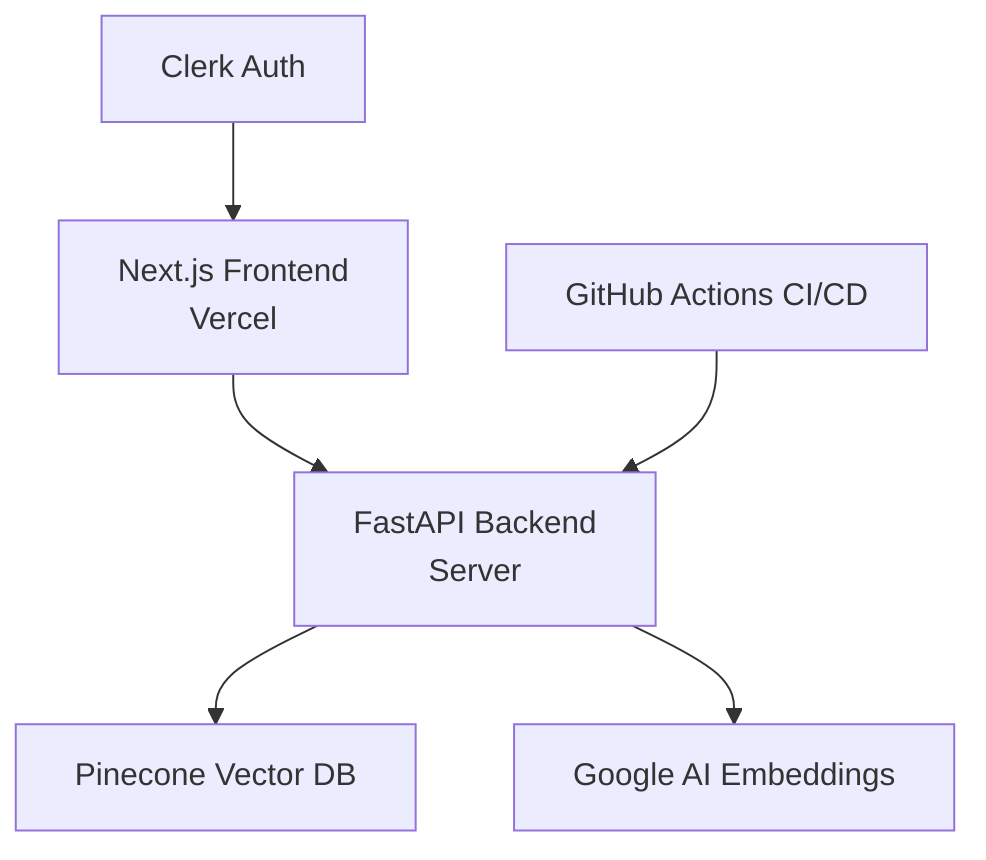

# 🤖 RAG Application

A modern Retrieval-Augmented Generation (RAG) application built with FastAPI backend and Next.js frontend. Upload PDF/TXT documents, ask questions, and get AI-powered answers with source citations.

## 🌟 Features

- **Document Upload**: Support for PDF and TXT files
- **AI-Powered Chat**: Ask questions about your uploaded documents
- **Source Citations**: Get references to the specific documents used in answers
- **Real-time Processing**: Instant document indexing and querying
- **User Authentication**: Secure authentication with Clerk
- **Modern UI**: Clean, responsive interface built with Tailwind CSS
- **Vector Storage**: Efficient document retrieval using Pinecone
- **CI/CD Pipeline**: Automated deployment with GitHub Actions

## 🏗️ Architecture

This application follows a **microservices-oriented architecture** with **separation of concerns**, implementing a modern **RAG (Retrieval-Augmented Generation) pattern**.

### 🔧 **Architecture Type: Client-Server with Vector Database Integration**



### 📂 **Project Structure**

```
📁 Project Root
├── 📁 server/                 # FastAPI Backend (API Layer)
│   ├── 📁 routes/            # API endpoints (Controller Layer)
│   │   ├── chat.py           # Chat functionality
│   │   └── upload.py         # File upload handling
│   ├── 📁 modules/           # Core business logic (Service Layer)
│   │   ├── llm.py           # LLM integration
│   │   ├── load_vectorstore.py  # Vector database operations
│   │   ├── pdf_handler.py    # PDF processing
│   │   └── query_handler.py  # Query processing
│   ├── 📁 middlewares/       # Request/response middleware
│   │   └── exception_handler.py
│   ├── main.py              # FastAPI application entry point
│   ├── logger.py            # Logging configuration
│   └── requirements.txt     # Python dependencies
├── 📁 frontend/             # Next.js Frontend (Presentation Layer)
│   ├── 📁 app/
│   │   ├── 📁 components/   # React components
│   │   ├── 📁 pages/        # Next.js pages
│   │   └── layout.tsx       # App layout
│   ├── package.json         # Node.js dependencies
│   └── tailwind.config.js   # Tailwind CSS configuration
├── .github/workflows/       # CI/CD pipelines
└── README.md               # Project documentation
```

### 🌐 **Architecture Patterns Implemented**

1. **🔄 RAG (Retrieval-Augmented Generation)**
   - Document ingestion → Vector embedding → Storage → Retrieval → Generation

2. **🏛️ Layered Architecture**
   - **Presentation Layer**: Next.js frontend with Tailwind UI
   - **API Layer**: FastAPI routes handling HTTP requests
   - **Service Layer**: Business logic modules for processing
   - **Data Layer**: Pinecone vector database + Google AI services

3. **🧩 Microservices-Oriented Design**
   - Separate concerns: Upload, Chat, Authentication, Vector Operations
   - Independent deployment of frontend and backend
   - External service integration (Clerk, Pinecone, Google AI)

4. **🔄 Event-Driven Processing**
   - File upload triggers vector processing pipeline
   - Real-time chat with async processing
   - Status updates and progress tracking

## 🚀 Tech Stack

### Backend
- **Framework**: FastAPI
- **Vector Database**: Pinecone
- **Embeddings**: Google Generative AI (embedding-001)
- **Document Processing**: LangChain, PyPDF
- **Authentication**: Integration with frontend auth
- **Deployment**: Python server with CI/CD

### Frontend
- **Framework**: Next.js 14+ (App Router)
- **Styling**: Tailwind CSS
- **Icons**: Lucide React
- **Authentication**: Clerk
- **Deployment**: Vercel
- **UI Components**: Custom components with shadcn/ui patterns

## 📋 Prerequisites

- Python 3.10+
- Node.js 18+
- npm or yarn
- Pinecone account
- Google AI API key
- Clerk account (for authentication)

## ⚙️ Environment Setup

### Backend Environment Variables
Create a `.env` file in the `server/` directory:

```env
# AI Services
GOOGLE_API_KEY=your_google_ai_api_key
PINECONE_API_KEY=your_pinecone_api_key

# Pinecone Configuration
PINECONE_INDEX_NAME=ragindex
PINECONE_ENVIRONMENT=us-east-1

# Server Configuration
PORT=8000
ENVIRONMENT=development
```

### Frontend Environment Variables
Create a `.env.local` file in the `frontend/` directory:

```env
# API Configuration
NEXT_PUBLIC_API_BASE_URL=http://localhost:8000

# Clerk Authentication
NEXT_PUBLIC_CLERK_PUBLISHABLE_KEY=your_clerk_publishable_key
CLERK_SECRET_KEY=your_clerk_secret_key

# Deployment
NEXT_PUBLIC_VERCEL_URL=your_vercel_deployment_url
```

## 🛠️ Installation & Setup

### Backend Setup

1. **Navigate to server directory**
   ```bash
   cd server
   ```

2. **Create virtual environment**
   ```bash
   python -m venv venv
   source venv/bin/activate  # On Windows: venv\Scripts\activate
   ```

3. **Install dependencies**
   ```bash
   pip install -r requirements.txt
   ```

4. **Run the server**
   ```bash
   uvicorn main:app --reload --host 0.0.0.0 --port 8000
   ```

### Frontend Setup

1. **Navigate to frontend directory**
   ```bash
   cd frontend
   ```

2. **Install dependencies**
   ```bash
   npm install
   # or
   yarn install
   ```

3. **Run development server**
   ```bash
   npm run dev
   # or
   yarn dev
   ```

4. **Open browser**
   Navigate to `http://localhost:3000`

## 🔧 API Endpoints

### Upload Endpoint
```http
POST /upload/
Content-Type: multipart/form-data

Description: Upload PDF or TXT files for processing
Parameters: files (multipart file upload)
Response: Success/failure status with processing details
```

### Chat Endpoint
```http
POST /chat/
Content-Type: multipart/form-data

Description: Ask questions about uploaded documents
Parameters: question (form data)
Response: AI answer with source citations
```

## 🎯 Usage

1. **Authentication**: Sign in using Clerk authentication
2. **Upload Documents**: 
   - Navigate to upload page
   - Select PDF or TXT files
   - Wait for processing confirmation
3. **Ask Questions**:
   - Go to chat interface
   - Type questions about your documents
   - Receive AI-powered answers with sources

## 🚀 Deployment

### Backend Deployment
The backend includes a CI/CD pipeline using GitHub Actions:

```yaml
# .github/workflows/deploy-server.yml
name: Deploy Server
on:
  push:
    branches: [main]
    paths: ['server/**']
```

### Frontend Deployment (Vercel)

1. **Connect Repository**
   - Import project in Vercel dashboard
   - Select the `frontend` folder as root directory

2. **Configure Build Settings**
   ```bash
   # Build Command
   npm run build
   
   # Output Directory
   .next
   
   # Install Command
   npm install
   ```

3. **Environment Variables**
   Add all required environment variables in Vercel dashboard

4. **Deploy**
   - Automatic deployment on git push
   - Branch previews for pull requests

## 🔍 Key Features Explained

### Document Processing
- **File Types**: PDF and TXT files supported
- **Chunking**: Documents split into optimal chunks for retrieval
- **Embeddings**: Generated using Google's embedding-001 model
- **Storage**: Vectors stored in Pinecone for fast similarity search

### Chat System
- **Context Retrieval**: Finds relevant document chunks
- **AI Generation**: Uses retrieved context to generate answers
- **Source Attribution**: Shows which documents were used
- **Real-time**: Instant responses with loading indicators

### Authentication
- **Clerk Integration**: Secure user authentication
- **User Profiles**: Display user avatars in chat
- **Session Management**: Persistent login state

## 🐛 Troubleshooting

### Common Issues

1. **Pinecone Import Error**
   ```bash
   pip uninstall pinecone-client
   pip install pinecone
   ```

2. **Embedding API Limits**
   - Check Google AI API quotas
   - Implement rate limiting if needed

3. **File Upload Issues**
   - Ensure file size limits are configured
   - Check supported file types

4. **Clerk Authentication**
   - Verify environment variables
   - Check domain configuration

### Debug Mode
Enable debug logging in the backend:
```python
# logger.py
import logging
logging.basicConfig(level=logging.DEBUG)
```

## 📊 Performance

- **Response Time**: < 2 seconds for most queries
- **File Processing**: ~1-3 seconds per MB
- **Concurrent Users**: Scales with server resources
- **Vector Search**: Sub-second similarity search

## 🤝 Contributing

1. Fork the repository
2. Create a feature branch
3. Make your changes
4. Add tests if applicable
5. Submit a pull request

## 📄 License

This project is licensed under the MIT License - see the [LICENSE](LICENSE) file for details.

## 🙏 Acknowledgments

- **LangChain** for document processing utilities
- **Pinecone** for vector database services
- **Google AI** for embedding models
- **Clerk** for authentication services
- **Vercel** for frontend hosting
- **FastAPI** for the backend framework

## 📞 Support

For support and questions:
- Create an issue in the GitHub repository
- Check the troubleshooting section above
- Review the API documentation

---

**Built with ❤️ using FastAPI, Next.js, and modern AI technologies**
